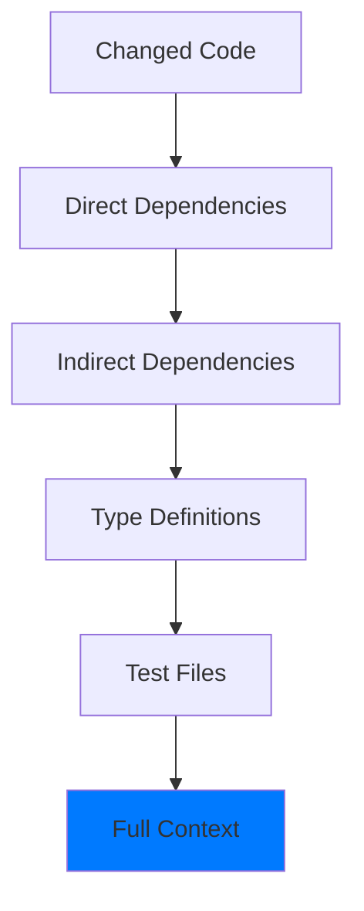

import { Callout, Steps } from 'nextra/components'

# AI Review Overview

Mesrai's AI review system combines advanced language models with deep code understanding to provide superhuman code reviews. Here's how it works.

## How It Works

<Steps>

### Code Change Detection
When you create or update a PR, GitHub sends a webhook to Mesrai with the change details.

### Context Extraction
Mesrai analyzes the PR diff and extracts relevant context from your entire codebase.

### Call Graph Building
We map function dependencies and relationships to understand the impact of changes.

### AI Analysis
Advanced LLMs analyze the code with full context and generate intelligent feedback.

### Review Posting
Formatted comments and suggestions are posted directly to your PR on GitHub.

</Steps>

## Review Quality

### What Makes Our Reviews Different?

Unlike traditional linters and static analysis tools, Mesrai provides:

#### 🧠 Contextual Understanding


We don't just look at the diff—we understand:
- How your changes affect other parts of the codebase
- Architectural patterns and design decisions
- Team conventions and coding standards
- Performance and security implications

#### ✨ Intelligent Suggestions
Our AI provides actionable feedback across multiple dimensions:

| Category | What We Check | Example |
|----------|---------------|---------|
| **Bugs** | Logic errors, null pointers, edge cases | "Line 45: Potential null dereference when user is undefined" |
| **Architecture** | Design patterns, separation of concerns | "Consider extracting payment logic to a separate service" |
| **Performance** | Query optimization, algorithmic complexity | "N+1 query detected in loop—use batch loading" |
| **Security** | Vulnerabilities, input validation | "SQL injection risk: use parameterized queries" |
| **Best Practices** | Code style, maintainability | "Use async/await instead of promise chains" |

#### 🎯 Precision Targeting
```javascript
// Example: Mesrai detects subtle issues
async function getUserData(userId) {
  const user = await db.users.findOne({ id: userId })
  return user.profile.address  // ⚠️ Mesrai catches this
}

// Mesrai's feedback:
// "Line 3: Potential error if user.profile is null
// Suggestion: Add null checks or use optional chaining
// user?.profile?.address ?? 'N/A'"
```

## Review Types

Mesrai offers different review depths based on your needs:

### Quick Review (2-5 seconds)
- **Focus**: Critical bugs and security issues
- **Scope**: Changed files only
- **Model**: GPT-4 Turbo
- **Use case**: Fast iterations, draft PRs

### Standard Review (5-15 seconds)
- **Focus**: Bugs, architecture, best practices
- **Scope**: Changed files + direct dependencies
- **Model**: GPT-4 Turbo + rules
- **Use case**: Regular PRs, feature development

### Deep Review (15-30 seconds)
- **Focus**: Comprehensive analysis, performance, security
- **Scope**: Full call graph, all dependencies
- **Model**: Claude-3 Opus
- **Use case**: Production releases, critical features

### Custom Review
- **Focus**: Your specific requirements
- **Scope**: Configurable
- **Model**: Custom or fine-tuned
- **Use case**: Enterprise with specific needs

<Callout type="info">
Configure review depth in your `.mesrai.yml` config file or via the dashboard.
</Callout>

## Review Triggers

### Automatic Triggers
Mesrai automatically reviews PRs when:

✅ New PR is opened  
✅ New commits are pushed to PR  
✅ PR is marked ready for review (from draft)  
✅ Specific labels are added (configurable)

### Manual Triggers
You can also request reviews manually:

```bash
# Via CLI
mesrai review --pr 123

# Via GitHub comment
@mesrai review

# Re-review with different depth
@mesrai review --depth deep
```

### Conditional Triggers
Configure when reviews should run:

```yaml
# .mesrai.yml
triggers:
  # Always review these branches
  branches:
    - main
    - production
    - develop
  
  # Only review if certain files change
  paths:
    - 'src/**/*.ts'
    - '!**/*.test.ts'  # Ignore tests
  
  # Skip reviews for certain users
  skip_users:
    - dependabot
    - renovate
```

## Review Output

### Comment Format
Reviews appear as GitHub PR comments with:

```markdown
## 🤖 Mesrai AI Review

### Summary
✅ 3 issues found  
⚡ 2 performance suggestions  
🔒 1 security concern

---

### 🐛 Issues

**Line 45**: `getUserById()`
> Potential null pointer dereference

**Current Code:**
​```typescript
const user = await db.users.findOne({ id })
return user.email  // ❌ Crashes if user is null
​```

**Suggested Fix:**
​```typescript
const user = await db.users.findOne({ id })
if (!user) throw new Error('User not found')
return user.email  // ✅ Safe
​```

---

### ⚡ Performance

**Line 89**: `loadUserPosts()`
> N+1 query detected in loop

Consider using batch loading or JOIN...
```

### Inline Comments
Critical issues also appear as inline comments on specific lines:

```typescript
async function checkout(cartId) {
  const cart = await getCart(cartId)
  
  for (const item of cart.items) {  // 💬 Mesrai: N+1 query ahead
    const product = await db.products.findOne({ id: item.productId })
    // Process item...
  }
}
```

### Review Metrics
Each review includes metrics:

```json
{
  "review_id": "rev_abc123",
  "pr_number": 456,
  "duration_ms": 8234,
  "issues_found": 5,
  "severity": {
    "critical": 1,
    "high": 2,
    "medium": 1,
    "low": 1
  },
  "tokens_used": 12450,
  "confidence_score": 0.94
}
```

## Continuous Learning

Mesrai improves over time by:

### Learning from Feedback
When developers accept or reject suggestions, our models learn:

```typescript
// You can provide feedback on reviews
await mesrai.feedback({
  reviewId: 'rev_abc123',
  helpful: true,
  comment: 'Great catch! Saved us from a production bug.'
})
```

### Adapting to Your Codebase
- **Pattern Recognition**: Identifies team-specific patterns
- **Convention Learning**: Understands your coding style
- **False Positive Reduction**: Reduces noise over time

### Custom Training
Enterprise customers can fine-tune models on their codebase:

```bash
# Train custom model
mesrai train --dataset ./reviews --epochs 10

# Use custom model
mesrai review --model custom-v2 --pr 123
```

<Callout type="warning">
**Privacy Note**: Your code is never used to train public models. Custom training is private to your organization.
</Callout>

## Review Settings

### Configure Review Behavior

```yaml
# .mesrai.yml
review:
  # Review depth
  depth: standard  # quick | standard | deep | custom
  
  # What to check
  checks:
    - bugs
    - security
    - performance
    - style
    - tests
  
  # Severity threshold
  min_severity: medium  # Only show medium+ issues
  
  # Auto-approve safe PRs
  auto_approve:
    enabled: true
    conditions:
      - max_files: 3
      - no_critical_issues: true
      - has_tests: true
```

### Team Preferences

```yaml
# Team-level configuration
team:
  # Preferred code style
  style_guide: airbnb  # airbnb | google | standard
  
  # Language-specific rules
  typescript:
    strict_null_checks: true
    no_any: warn
  
  # Custom rules
  custom_rules:
    - name: "No TODO in production"
      pattern: "TODO|FIXME"
      severity: error
      branches: [main, production]
```

---

**Next**: Learn about [token usage optimization](/ai-review/token-usage) →
