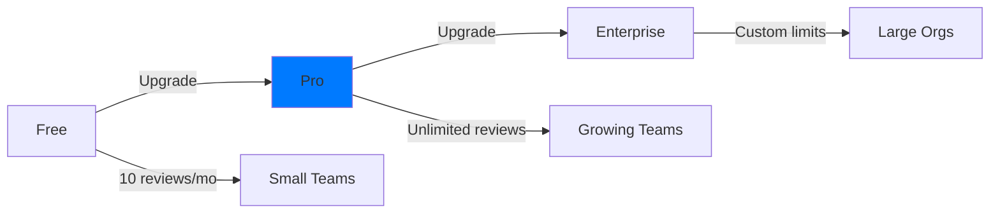

import { Callout } from "nextra/components";

# Subscription Model

Mesrai offers flexible subscription plans designed to scale with your team, from individual developers to enterprise organizations.

## Overview

Our pricing is transparent and predictable, with three core tiers:



## Plan Comparison

| Feature             | Free        | Pro              | Enterprise           |
| ------------------- | ----------- | ---------------- | -------------------- |
| **Monthly Reviews** | 10          | Unlimited        | Custom               |
| **Repositories**    | Public only | Public + Private | Unlimited            |
| **Team Members**    | 1-3         | Unlimited        | Unlimited            |
| **AI Models**       | GPT-4 Turbo | GPT-4 + Claude   | Custom + On-premise  |
| **Support**         | Community   | Priority Email   | Dedicated Slack      |
| **SLA**             | None        | 99.5%            | 99.9% + Custom       |
| **Custom Rules**    | ❌          | ✅               | ✅                   |
| **SSO/SAML**        | ❌          | ❌               | ✅                   |
| **On-Premise**      | ❌          | ❌               | ✅                   |
| **API Access**      | Limited     | Full             | Full + Higher limits |

## Free Plan

Perfect for open-source projects and small teams getting started.

### What's Included

- **50 reviews per month** across all repositories
- **Public repositories only**
- **Up to 3 team members**
- **Community support** via Discord
- **Basic AI features** (GPT-4 Turbo)
- **Standard integrations** (GitHub)

### Limitations

```typescript
const freePlanLimits = {
  monthlyReviews: 50,
  repoVisibility: "public",
  teamSize: 3,
  supportTier: "community",
  apiRateLimit: 100, // requests per hour
};
```

<Callout type="info">
  **Perfect for**: Open-source maintainers, indie hackers, student projects
</Callout>

## Pro Plan

**$49 per user/month** (billed annually) or **$59/month** (monthly billing)

Designed for professional teams that need unlimited reviews and advanced features.

### What's Included

- ✅ **Unlimited reviews** across all repositories
- ✅ **Private repositories** supported
- ✅ **Unlimited team members** ($49/user)
- ✅ **Priority email support** (24-hour response)
- ✅ **Advanced AI models** (GPT-4 + Claude)
- ✅ **Custom review rules** and configurations
- ✅ **Advanced analytics** and insights
- ✅ **Full API access** (5000 req/hour)
- ✅ **Webhook integrations**
- ✅ **Team collaboration tools**

### Pricing Examples

```javascript
// Pro plan pricing calculator
function calculateProPlan(users, billingPeriod = "annual") {
  const pricePerUser = billingPeriod === "annual" ? 49 : 59;
  const monthlyTotal = users * pricePerUser;
  const annualTotal = monthlyTotal * 12;

  return {
    monthly: monthlyTotal,
    annual: annualTotal,
    savings: billingPeriod === "annual" ? users * 10 * 12 : 0,
  };
}

// Examples:
// 5 developers: $245/month ($2,940/year, save $600)
// 15 developers: $735/month ($8,820/year, save $1,800)
// 50 developers: $2,450/month ($29,400/year, save $6,000)
```

<Callout type="warning">
  **Volume Discounts**: Teams with 25+ developers get 15% off. Contact sales for
  custom pricing.
</Callout>

## Enterprise Plan

**Custom pricing** based on your specific needs.

Perfect for large organizations requiring dedicated infrastructure, enhanced security, and enterprise support.

### What's Included

Everything in Pro, plus:

#### 🏢 Infrastructure

- **Dedicated infrastructure** for your organization
- **On-premise deployment** option
- **Custom region selection** for data residency
- **Dedicated database** instances
- **VPC/Private network** integration

#### 🔒 Security & Privacy

- **SSO/SAML authentication** (Okta, Azure AD, Google)
- **Zero code storage** — code never persisted
- **Isolated sandbox** processing environments
- **Custom data retention** policies
- **Audit logs** and activity reporting
- **Dedicated security support**

#### 🎯 Advanced Features

- **Custom AI models** (fine-tuned for your codebase)
- **Unlimited API rate limits**
- **Advanced security scanning**
- **Custom integrations** (GitLab, Bitbucket)
- **White-label options**

#### 💪 Support & SLA

- **99.9% uptime SLA** with financial penalties
- **Dedicated support channel** (Slack Connect)
- **1-hour response time** for critical issues
- **Dedicated customer success manager**
- **Quarterly business reviews**
- **Custom onboarding** and training

### Enterprise Pricing Structure

```typescript
interface EnterprisePricing {
  basePrice: number; // Starting at $2,500/month
  perUserCost: number; // $35-45/user (volume discounts)
  infrastructure: number; // $500-2000/month (based on scale)
  support: number; // Included
  customFeatures: number; // Based on requirements
}

// Example: 100-developer organization
const enterpriseExample = {
  basePrice: 2500,
  users: 100 * 40, // $4,000
  infrastructure: 1500, // Dedicated setup
  total: 8000, // $8,000/month
};
```

## Plan Selection Guide

### Choose Free If:

- You're working on open-source projects
- You have a small team (1-3 developers)
- You need basic code review automation
- You're evaluating Mesrai

### Choose Pro If:

- You have private repositories
- Your team is 3-50 developers
- You need unlimited reviews
- You want advanced AI features
- You need priority support

### Choose Enterprise If:

- Your team is 50+ developers
- You need enhanced security features
- You require on-premise deployment
- You need SSO/SAML authentication
- You want dedicated support
- You have custom requirements

## Billing Cycle

### Monthly Billing

- **Charged on the 1st** of each month
- **Pay-as-you-go** flexibility
- **Cancel anytime** (no contracts)
- **Pro-rated refunds** for unused time

### Annual Billing

- **17% discount** compared to monthly
- **Billed once per year**
- **Lock in current pricing**
- **Priority feature access**

### Usage Tracking

```javascript
// Real-time usage dashboard
const currentUsage = {
  plan: "Pro",
  users: 12,
  reviewsThisMonth: 847,
  apiCalls: 3240,
  estimatedCost: 588, // $49 * 12 users
  billingDate: "2025-11-01",
};
```

## Add-ons & Extras

### Available Add-ons

| Add-on                 | Price      | Description                 |
| ---------------------- | ---------- | --------------------------- |
| **Advanced Security**  | $99/month  | Deep vulnerability scanning |
| **Compliance Reports** | $199/month | Automated security reporting |
| **Custom Models**      | $499/month | Fine-tuned AI for your code |
| **Dedicated Support**  | $999/month | 24/7 phone + Slack support  |

## Upgrade & Downgrade

### Upgrading

1. Visit **Settings → Billing**
2. Click **Upgrade Plan**
3. Select your new plan
4. Confirm payment method
5. **Instant activation** ✨

### Downgrading

1. Request downgrade before billing date
2. Use remaining features until cycle ends
3. Downgrade takes effect next billing period
4. **No refunds** for partial months

<Callout type="info">
  **Pro Tip**: Upgrade mid-cycle? You'll only pay the pro-rated difference.
</Callout>

## Payment Methods

We accept:

- 💳 **Credit Cards** (Visa, Mastercard, Amex)
- 🏦 **ACH/Bank Transfer** (Enterprise only)
- 📄 **Invoice + PO** (Enterprise only)
- 💰 **Annual Prepay** (get 2 months free)

All payments processed securely through Stripe.

---

**Next**: Learn about [Stripe integration](/billing/stripe-integration) →
