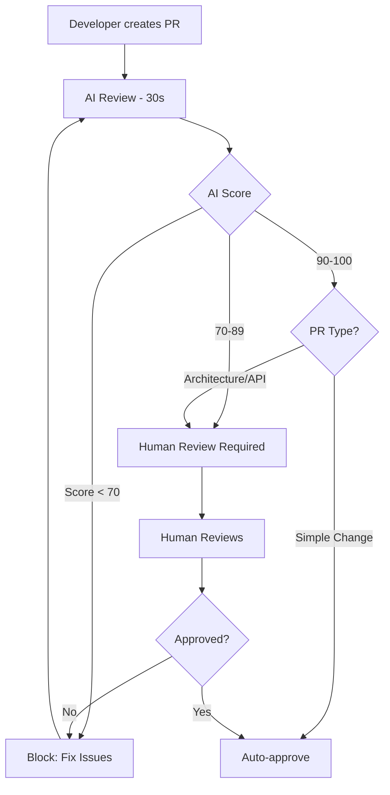

import { ArticleSchema } from '../../components/seo/JsonLd'

<ArticleSchema
  title="AI-Powered Code Review vs Traditional Code Review - Which is Better?"
  description="Compare AI-powered and traditional code reviews. Learn the strengths, weaknesses, and how to combine both approaches for maximum effectiveness in 2025."
  datePublished="2025-01-10"
  author="Mesrai Team"
/>

# AI-Powered Code Review vs Traditional Code Review: Which is Better?

Code review has evolved dramatically in recent years. With the rise of AI-powered tools, many teams are wondering: should we stick with traditional human reviews, embrace AI automation, or find a balance between both?

In this comprehensive comparison, we'll explore the strengths and weaknesses of each approach and show you how to combine them for maximum effectiveness.

## Traditional Code Review: The Human Touch

### How It Works

Traditional code review involves human developers manually reviewing pull requests:

1. **Developer submits PR** with code changes
2. **Reviewer(s) assigned** manually or automatically
3. **Human review** of code logic, architecture, style
4. **Feedback provided** via comments and suggestions
5. **Iteration** until code meets standards
6. **Approval and merge** when ready

### Strengths of Traditional Review

#### 1. Contextual Understanding

Humans excel at understanding:
- Business requirements and goals
- User experience implications
- Product strategy alignment
- Team dynamics and history

```javascript
// Humans can evaluate if this meets business needs
function calculateDiscount(user, product) {
  // Is 20% the right discount for premium users?
  // Should we consider purchase history?
  // What about seasonal promotions?
  return user.isPremium ? product.price * 0.8 : product.price
}
```

#### 2. Architectural Insight

Experienced developers provide:
- System design feedback
- Scalability considerations
- Long-term maintainability advice
- Alternative approach suggestions

#### 3. Mentorship and Learning

Code reviews serve as teaching moments:
- Junior developers learn from seniors
- Knowledge sharing across teams
- Best practices dissemination
- Career development opportunities

#### 4. Nuanced Judgment

Humans make judgment calls on:
- When to compromise on perfection
- Technical debt trade-offs
- Priority of different issues
- Team-specific considerations

### Weaknesses of Traditional Review

#### 1. Time-Consuming

Human reviews can be slow:
- ⏱️ Average review time: 4-24 hours
- 🐌 Large PRs: Days or weeks
- 🔄 Multiple review cycles needed
- ⏸️ Waiting for reviewer availability

```bash
# Reality of traditional review timelines
09:00 - Submit PR
13:00 - First reviewer looks (4 hours)
14:00 - Make changes based on feedback
Next day 10:00 - Second review (20 hours)
Next day 15:00 - Final approval (29 hours total)
```

#### 2. Inconsistent Quality

Review quality varies based on:
- Reviewer experience and expertise
- Reviewer workload and fatigue
- Time of day and energy levels
- Personal biases and preferences

#### 3. Limited Coverage

Humans can miss:
- Subtle security vulnerabilities
- Performance bottlenecks in complex code
- Edge cases in conditional logic
- Consistency across large codebases

#### 4. Scalability Issues

Traditional review doesn't scale well:
- Bottlenecks with senior reviewers
- Delays when reviewers are unavailable
- Inconsistent standards across teams
- Difficulty with distributed teams

## AI-Powered Code Review: The Automated Future

### How It Works

AI-powered code review uses machine learning to analyze code automatically:

1. **PR created** triggers automated review
2. **AI analyzes** code using trained models
3. **Instant feedback** provided (seconds)
4. **Inline comments** on specific issues
5. **Quality score** and summary generated
6. **Continuous learning** from patterns

### Strengths of AI Review

#### 1. Speed and Availability

AI reviews are incredibly fast:
- ⚡ Review time: 5-60 seconds
- 🌍 Available 24/7 globally
- 🔄 Instant re-reviews after changes
- 📈 Scales infinitely

```bash
# AI review timeline
10:00:00 - Submit PR
10:00:05 - AI review complete (5 seconds!)
10:15:00 - Update code
10:15:05 - AI re-review complete (5 seconds!)
```

#### 2. Consistency

AI provides uniform standards:
- ✅ Same rules applied every time
- ✅ No reviewer fatigue or bias
- ✅ Consistent across all teams
- ✅ 100% coverage of every line

#### 3. Comprehensive Scanning

AI excels at finding:
- Security vulnerabilities
- Performance issues
- Code smells and antipatterns
- Style violations
- Complexity metrics

```javascript
// AI automatically detects these issues

// 🔒 Security: SQL injection vulnerability
const query = `SELECT * FROM users WHERE id = ${userId}`

// ⚠️ Performance: N+1 query problem
users.forEach(user => {
  user.posts = db.query(`SELECT * FROM posts WHERE user_id = ${user.id}`)
})

// 🧹 Code smell: High complexity (cyclomatic complexity > 10)
function validateForm(data) {
  if (data.name) {
    if (data.email) {
      if (data.phone) {
        if (data.address) {
          // ... 7 more nested conditions
        }
      }
    }
  }
}
```

#### 4. Pattern Recognition

AI learns from millions of code samples:
- Industry best practices
- Common bug patterns
- Security vulnerability patterns
- Performance optimization techniques

#### 5. Cost-Effective at Scale

For large teams, AI is economical:
- No additional hiring needed
- Instant reviews reduce wait time
- Frees senior developers for architecture
- Consistent quality without training

### Weaknesses of AI Review

#### 1. Limited Context Understanding

AI struggles with:
- Business logic correctness
- Product requirements alignment
- User experience considerations
- Team-specific conventions

```javascript
// AI can't evaluate if this business logic is correct
function shouldShowAd(user) {
  // Is this the right threshold?
  // Should we consider other factors?
  // What's the business goal?
  return user.pageViews > 5 && !user.isPremium
}
```

#### 2. False Positives

AI can flag non-issues:
- Legitimate complexity in algorithms
- Intentional deviations from standards
- Domain-specific patterns
- Creative solutions

#### 3. No Mentorship

AI can't provide:
- Explanations of "why" behind best practices
- Career guidance and learning
- Team building through collaboration
- Cultural knowledge transfer

#### 4. Emerging Patterns

AI may miss:
- Novel approaches or patterns
- Cutting-edge techniques
- Project-specific innovations
- Recent vulnerability types (until retrained)

## Head-to-Head Comparison

| Aspect | Traditional (Human) | AI-Powered | Winner |
|--------|-------------------|------------|--------|
| **Speed** | 4-24 hours | 5-60 seconds | 🤖 AI |
| **Consistency** | Variable | 100% consistent | 🤖 AI |
| **Coverage** | Selective | Comprehensive | 🤖 AI |
| **Cost (large teams)** | High | Low | 🤖 AI |
| **Scalability** | Limited | Infinite | 🤖 AI |
| **Context awareness** | Excellent | Limited | 👤 Human |
| **Business logic** | Excellent | Poor | 👤 Human |
| **Architecture review** | Excellent | Basic | 👤 Human |
| **Mentorship** | Excellent | None | 👤 Human |
| **Nuanced judgment** | Excellent | Limited | 👤 Human |
| **Security (common)** | Good | Excellent | 🤖 AI |
| **Security (novel)** | Good | Limited | 👤 Human |
| **Performance issues** | Good | Excellent | 🤖 AI |
| **24/7 availability** | No | Yes | 🤖 AI |

### What The Data Shows

Recent studies reveal interesting patterns:

**Speed Comparison**:
```
Traditional Review:
├── Small PR (< 200 lines): 2-4 hours
├── Medium PR (200-500 lines): 4-8 hours
└── Large PR (> 500 lines): 1-3 days

AI Review:
├── Small PR: 5-15 seconds
├── Medium PR: 15-45 seconds
└── Large PR: 45-90 seconds

Speed improvement: 100-1000x faster
```

**Defect Detection Rates**:
```
Common Issues (style, simple bugs):
├── Human: 70-80%
├── AI: 95-99%
└── Winner: AI

Security Vulnerabilities:
├── Human: 60-70%
├── AI: 90-95%
└── Winner: AI

Architecture Issues:
├── Human: 85-95%
├── AI: 40-60%
└── Winner: Human

Business Logic Errors:
├── Human: 75-85%
├── AI: 30-50%
└── Winner: Human
```

## The Best Approach: Hybrid Review

The most effective strategy combines both:

### Two-Tier Review Process

#### Tier 1: AI First Pass (Automated)
AI handles the heavy lifting:
```yaml
ai_review:
  automated_checks:
    - Security scanning
    - Performance analysis
    - Code style enforcement
    - Complexity metrics
    - Test coverage validation
    - Documentation completeness

  threshold:
    - Block merge if critical issues found
    - Flag warnings for human review
    - Auto-approve if score > 90%
```

#### Tier 2: Human Strategic Review (Selective)
Humans focus on what matters:
```markdown
Human review focuses on:
□ Business logic correctness
□ Architectural decisions
□ User experience implications
□ API design and contracts
□ Scalability considerations
□ Team knowledge sharing
```

### Implementation Example

Here's how to implement hybrid review:

```yaml
# .mesrai/config.yml
review_strategy: hybrid

ai_review:
  automatic: true
  blocking_issues:
    - security_critical
    - performance_regression
    - test_coverage_drop

  auto_approve_if:
    - score >= 90
    - no_warnings
    - pr_size < 200_lines
    - author_is_senior

human_review:
  required_for:
    - architectural_changes
    - api_changes
    - database_migrations
    - critical_paths
    - pr_size > 500_lines

  optional_for:
    - minor_fixes
    - documentation
    - test_updates
    - style_changes
```

### Workflow in Practice



### Benefits of Hybrid Approach

#### 1. Best of Both Worlds
- ⚡ Speed of AI for common issues
- 🧠 Human insight for complex decisions
- 💰 Cost-effective at scale
- 🎓 Learning opportunities preserved

#### 2. Efficient Resource Allocation

```javascript
// Before hybrid: All PRs need human review
Average PRs per day: 50
Time per review: 30 minutes
Total time: 25 hours/day (3+ FTEs needed)

// After hybrid: Only complex PRs need human review
PRs auto-handled by AI: 35 (70%)
PRs needing human review: 15 (30%)
Time per review: 30 minutes
Total time: 7.5 hours/day (1 FTE needed)

Savings: 70% reduction in review time
```

#### 3. Improved Team Satisfaction

Developers report higher satisfaction with hybrid review:
- ✅ Faster feedback on simple issues
- ✅ More meaningful human discussions
- ✅ Less nitpicking in reviews
- ✅ Focus on learning and growth

## Real-World Case Studies

### Case Study 1: Startup (10 developers)

**Before AI (Traditional only)**:
- Review time: 8-24 hours average
- Bottleneck: Senior developers overwhelmed
- Quality: Inconsistent (fatigue issues)
- Defects: 12 bugs per sprint in production

**After Hybrid (AI + Human)**:
- Review time: 1-4 hours average
- Senior time freed: 15 hours/week
- Quality: Consistent automated standards
- Defects: 4 bugs per sprint in production

**Results**: 3x faster reviews, 67% fewer bugs

### Case Study 2: Scale-up (50 developers)

**Before AI (Traditional only)**:
- Review time: 12-48 hours average
- Cost: 2 FTE dedicated reviewers
- Scalability: Major bottleneck to growth
- Consistency: Varied by team

**After Hybrid (AI + Human)**:
- Review time: 2-6 hours average
- Cost: 0.5 FTE + AI tool subscription
- Scalability: Unlimited
- Consistency: Uniform across all teams

**Results**: 4x faster reviews, 75% cost reduction

### Case Study 3: Enterprise (500 developers)

**Before AI (Traditional only)**:
- Review time: 24-72 hours average
- Cost: 20 FTE dedicated reviewers
- Security: 15 vulnerabilities/month to production
- Knowledge sharing: Siloed teams

**After Hybrid (AI + Human)**:
- Review time: 4-12 hours average
- Cost: 5 FTE + AI tool subscription
- Security: 2 vulnerabilities/month to production
- Knowledge sharing: Cross-team AI standards

**Results**: 6x faster reviews, 87% fewer vulnerabilities

## Making the Transition

### Step 1: Start with AI Augmentation

Don't replace humans immediately:

```markdown
Week 1-2: Observe
- Run AI reviews in parallel
- Compare AI vs human findings
- Identify AI strengths/weaknesses

Week 3-4: Assist
- Use AI to pre-screen PRs
- Humans review flagged issues
- Gather team feedback

Week 5-6: Automate
- Auto-approve simple PRs
- Require human review for complex
- Monitor quality metrics
```

### Step 2: Define Clear Guidelines

Document when each type applies:

```yaml
auto_approve_criteria:
  - ai_score >= 90
  - no_security_issues
  - no_performance_regressions
  - pr_size < 200_lines
  - only_additive_changes

require_human_review:
  - api_changes
  - database_schema_changes
  - security_critical_code
  - architectural_changes
  - pr_size > 500_lines
```

### Step 3: Measure and Iterate

Track important metrics:

```javascript
{
  "review_velocity": {
    "ai_only": "45 seconds",
    "ai_then_human": "3 hours",
    "human_only": "18 hours"
  },
  "quality_metrics": {
    "defects_found_in_review": 234,
    "defects_escaped_to_prod": 12,
    "false_positives": 45
  },
  "team_satisfaction": {
    "overall": 4.2,  // out of 5
    "ai_helpfulness": 4.5,
    "human_review_quality": 4.3
  }
}
```

Use [Mesrai's analytics](/features/teams/team-analytics) to track these metrics automatically.

## Choosing the Right Tool

When selecting an AI code review tool, consider:

### Essential Features

✅ **GitHub Integration**: Seamless PR workflow
✅ **Inline Comments**: Specific, actionable feedback
✅ **Customizable Rules**: Match your team's standards
✅ **Security Scanning**: Comprehensive vulnerability detection
✅ **Performance Analysis**: Identify bottlenecks
✅ **Fast Reviews**: Sub-minute response times

### Advanced Features

✅ **Architecture Analysis**: Call graph mapping
✅ **Context Awareness**: Understanding relationships
✅ **Team Analytics**: Track metrics and trends
✅ **Custom Training**: Adapt to your codebase
✅ **API Access**: Integrate with your tools

### Why Choose Mesrai

Mesrai offers all of the above plus:
- 🤖 Advanced AI models trained on millions of repos
- ⚡ Sub-60-second reviews
- 🔒 SOC 2 Type II certified security
- 📊 Comprehensive team analytics
- 🎯 95%+ accuracy rate
- 💰 Transparent pricing with free tier

[Get started with Mesrai →](https://app.mesrai.com/signup)

## Conclusion

**The verdict**: Neither AI nor traditional review is "better" universally. The optimal approach is hybrid:

✅ Use **AI** for:
- Initial screening and common issues
- Security and performance scanning
- Style and consistency enforcement
- Fast feedback on simple changes

✅ Use **Human review** for:
- Architectural decisions
- Business logic validation
- Complex problem-solving
- Mentorship and knowledge sharing

By combining both, you get:
- 🚀 Speed of automation
- 🧠 Wisdom of experience
- 💰 Cost efficiency
- 🎓 Continued learning

The future of code review isn't AI replacing humans—it's AI empowering humans to focus on what they do best.

## Next Steps

Ready to implement hybrid code review?

1. **Try Mesrai**: [Start free trial](https://app.mesrai.com/signup)
2. **Setup GitHub**: [Integration guide](/blog/github-integration-guide)
3. **Learn Best Practices**: [Code review guide](/blog/code-review-best-practices)
4. **Configure Teams**: [Team setup](/features/teams/introduction)

---

**Related Articles**:
- [Complete GitHub Integration Guide](/blog/github-integration-guide)
- [Code Review Best Practices](/blog/code-review-best-practices)
- [Team Analytics Guide](/features/teams/team-analytics)
