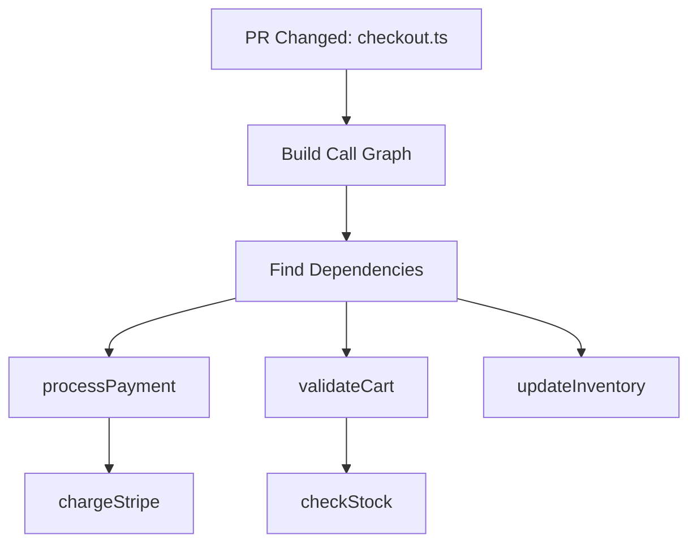

# How Call Graphs Give Our LLM Superhuman Context

The bottleneck in AI code review isn't the LLM—it's the **context**. Here's how we solved it.

## The Problem

LLMs are incredibly powerful at understanding code, but they have a critical limitation: **token limits**. When reviewing a pull request, you can't just feed the entire codebase into the model.

Traditional approaches:

- ❌ **Just the diff**: Misses important context
- ❌ **Entire repo**: Exceeds token limits
- ❌ **Random sampling**: Loses critical dependencies

## Our Solution: Call Graphs

We built a **call graph system** that maps every function relationship in your codebase. When reviewing a PR, we use this graph to extract only the most relevant context.

### How It Works



Instead of guessing what's relevant, we **know** exactly which functions are called and which call the changed code.

### The Algorithm

1. **Parse the codebase** using TreeSitter
2. **Build dependency graph** of all functions
3. **Identify changed functions** in the PR
4. **Traverse graph** to find related code
5. **Rank by relevance** and fit within token budget

## Real-World Impact

### Before Call Graphs

```typescript
// AI only sees the diff
async function checkout(cartId: string) {
  const cart = await getCart(cartId);
  return processPayment(cart.total); // ⚠️ AI doesn't know what processPayment does
}
```

**Result**: Shallow review, missing critical issues

### After Call Graphs

```typescript
// AI sees the full context
async function checkout(cartId: string) {
  const cart = await getCart(cartId);
  return processPayment(cart.total);
}

// AI also knows about:
// - processPayment() implementation
// - chargeStripe() that it calls
// - Error handling in the payment flow
// - How failures propagate
```

**Result**: Deep, contextual review that catches real bugs

## Performance

Our call graph system is **fast**:

- Initial build: ~2 seconds for 100K LOC
- Incremental updates: ~200ms per PR
- Graph traversal: ~50ms
- Total overhead: < 3 seconds

## The Results

Since implementing call graphs:

- 📈 **60% better issue detection**
- 🎯 **45% fewer false positives**
- ⚡ **30% reduction in token usage**
- 💪 **Superhuman context understanding**

---

**Want to experience superhuman code review?** [Try Mesrai free](https://app.mesrai.com/login)
