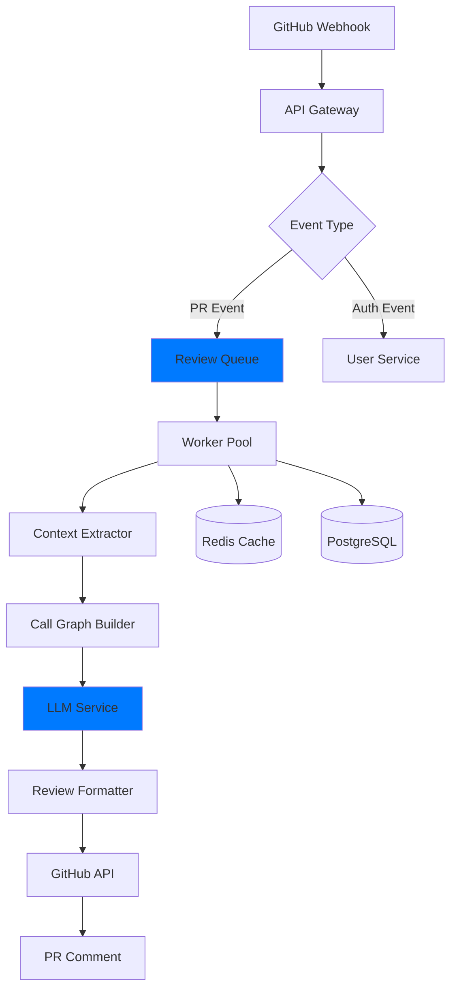
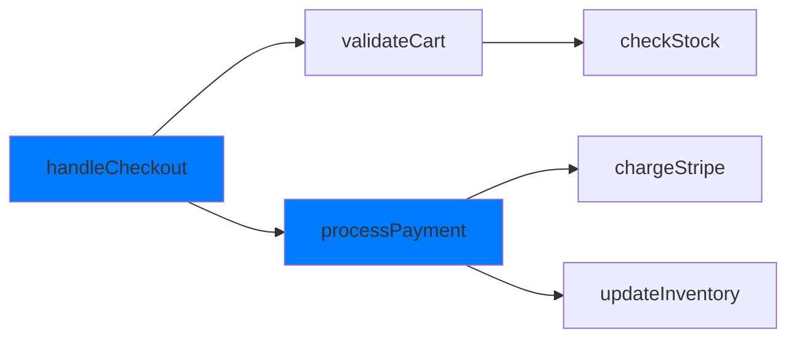
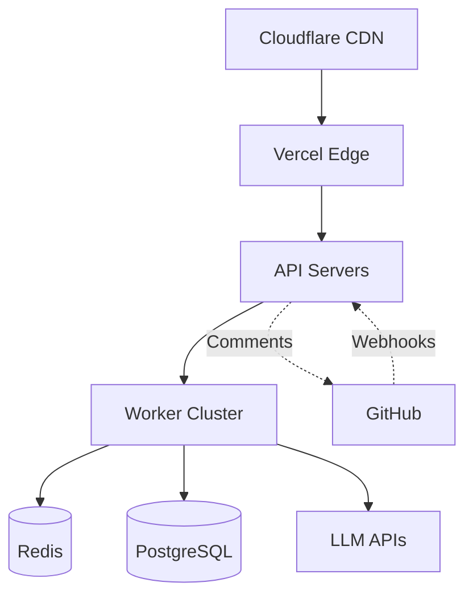

import { Callout, Steps } from 'nextra/components'

# Core Architecture

Understanding Mesrai's architecture helps you leverage the platform effectively and troubleshoot issues when they arise.

## System Overview

Mesrai is built as a distributed, event-driven system optimized for performance and scalability.



## Core Components

### 1. API Gateway
**Technology**: Node.js + Express  
**Purpose**: Entry point for all requests

- **Request Routing**: Directs traffic to appropriate services
- **Authentication**: Validates GitHub tokens and API keys
- **Rate Limiting**: Prevents abuse (1000 req/min per user)
- **Load Balancing**: Distributes load across workers

```javascript
// Simplified API Gateway flow
app.post('/webhook/github', async (req, res) => {
  const signature = verifyGitHubSignature(req)
  const event = parseGitHubEvent(req.body)
  
  await queue.add('review', {
    prNumber: event.pull_request.number,
    repo: event.repository.full_name
  })
  
  res.status(202).send({ queued: true })
})
```

### 2. Review Queue
**Technology**: BullMQ + Redis  
**Purpose**: Asynchronous job processing

<Callout type="info">
Queue priority ensures critical PRs (production branches, security fixes) are reviewed first.
</Callout>

**Queue Priorities**:
- **Critical**: Production hotfixes (priority 1)
- **High**: Main/master branch PRs (priority 2)  
- **Normal**: Feature branches (priority 3)
- **Low**: Draft PRs (priority 4)

### 3. Worker Pool
**Technology**: Node.js clusters  
**Purpose**: Parallel review processing

**Worker Capabilities**:
- **Auto-scaling**: Scales from 2 to 50 workers based on queue depth
- **Fault Tolerance**: Failed jobs retry up to 3 times
- **Resource Management**: Each worker has dedicated CPU/memory limits
- **Health Monitoring**: Workers report status every 30 seconds

```typescript
// Worker configuration
const workerConfig = {
  concurrency: 5,
  maxMemory: '2GB',
  timeout: 300000, // 5 minutes
  retries: 3,
  backoff: {
    type: 'exponential',
    delay: 2000
  }
}
```

### 4. Context Extractor
**Technology**: TreeSitter + Git  
**Purpose**: Extract relevant code context

<Steps>

### Parse PR Diff
Extract changed files and line numbers from the pull request

### Build File Dependency Graph
Identify which files import/use the changed files

### Extract Relevant Context
Pull in related functions, classes, and modules

### Optimize Token Budget
Compress context to fit LLM token limits

</Steps>

**Context Selection Strategy**:
```javascript
const contextPriority = [
  'changed_lines',           // Highest priority
  'changed_functions',
  'direct_dependencies',
  'type_definitions',
  'imported_modules',
  'related_tests',          // Lowest priority
]
```

### 5. Call Graph Builder
**Technology**: Custom AST parser  
**Purpose**: Map function relationships

The call graph shows how functions depend on each other:



**Graph Metrics**:
- **Depth**: How many levels of calls (max: 5)
- **Breadth**: Number of functions called (avg: 8)
- **Complexity**: Cyclomatic complexity score
- **Coverage**: Percentage of codebase mapped

### 6. LLM Service
**Technology**: OpenAI GPT-4 + Claude  
**Purpose**: AI-powered code analysis

**Model Selection**:
| Use Case | Model | Token Limit | Response Time |
|----------|-------|-------------|---------------|
| Quick reviews | GPT-4-Turbo | 128K | 2-5s |
| Deep analysis | Claude-3 Opus | 200K | 10-15s |
| Security scan | GPT-4 + rules | 128K | 3-7s |

**Prompt Engineering**:
```typescript
const reviewPrompt = `
You are an expert code reviewer analyzing a pull request.

Context:
${callGraph}
${dependencies}
${changedFiles}

Tasks:
1. Identify potential bugs
2. Suggest architectural improvements
3. Check for security vulnerabilities
4. Recommend performance optimizations

Format: Provide specific line-by-line feedback.
`
```

### 7. Review Formatter
**Technology**: Markdown + GitHub API  
**Purpose**: Format and post reviews

**Comment Structure**:
```markdown
## 🤖 Mesrai AI Review

### 🐛 Potential Issues (2)
- Line 45: Possible null pointer dereference
- Line 89: Inefficient database query in loop

### ✨ Suggestions (3)
- Consider using async/await for better error handling
- Extract validation logic to separate function
- Add unit tests for edge cases

### 📊 Metrics
- Complexity Score: 12 (Medium)
- Test Coverage: 78%
- Security Score: A
```

## Data Flow

### Pull Request Review Flow

<Steps>

### PR Created/Updated
Developer pushes code, GitHub sends webhook

### Event Processing
API Gateway validates and queues the review job

### Context Extraction
Worker extracts relevant code context (2-3s)

### Call Graph Building
System maps function dependencies (1-2s)

### AI Analysis
LLM analyzes code and generates feedback (5-10s)

### Review Posting
Formatted comments posted to GitHub (1s)

</Steps>

**Total Time**: 10-15 seconds for average PR

## Infrastructure

### Deployment Architecture



### Technology Stack

**Frontend**:
- Next.js 15 (Dashboard)
- React 19
- TailwindCSS
- Vercel Edge

**Backend**:
- Node.js 20
- Express.js
- TypeScript
- BullMQ

**Database**:
- PostgreSQL (primary data)
- Redis (cache + queues)
- S3 (file storage)

**Infrastructure**:
- Vercel (hosting)
- AWS (databases)
- Cloudflare (CDN)

### Scaling Strategy

<Callout type="warning">
**Auto-scaling triggers**:
- Queue depth > 100 jobs → Add workers
- API latency > 500ms → Scale servers
- Cache hit rate < 80% → Increase Redis memory
</Callout>

**Current Capacity**:
- **API**: 10K requests/second
- **Reviews**: 1000 PRs/hour
- **Workers**: 2-50 (auto-scale)
- **Storage**: Unlimited

## Performance Optimizations

### Caching Strategy

```typescript
// Multi-layer caching
const review = await cache.get(`pr:${prId}:review`)

if (!review) {
  // Check call graph cache
  const callGraph = await cache.get(`repo:${repoId}:graph`)
  
  if (!callGraph) {
    // Build and cache
    callGraph = await buildCallGraph(repo)
    await cache.set(`repo:${repoId}:graph`, callGraph, '24h')
  }
  
  review = await generateReview(callGraph, pr)
  await cache.set(`pr:${prId}:review`, review, '1h')
}
```

### Database Optimization

- **Connection Pooling**: 20 connections per instance
- **Query Optimization**: Indexed on PR number, repo ID
- **Read Replicas**: Separate read/write databases
- **Partitioning**: PRs partitioned by month

---

**Next Steps**: Learn how to [install and configure Mesrai](/setup/installation) →
