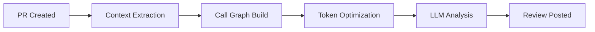

import { Callout } from "nextra/components";

# Key Capabilities

Mesrai provides enterprise-grade capabilities designed for modern software development teams. Here's what makes us different.

## 🧠 AI-Powered Code Reviews

### Superhuman Context Understanding

Unlike basic linters, Mesrai builds a complete mental model of your codebase:

- **Call Graph Analysis**: Maps function dependencies across your entire repository
- **Architectural Pattern Recognition**: Identifies design patterns and suggests improvements
- **Cross-File Impact Analysis**: Understands how changes in one file affect others
- **Historical Context**: Learns from your team's coding patterns and conventions

### Advanced LLM Integration

We use state-of-the-art language models optimized for code:



<Callout type="info">
  **Smart Token Management**: Mesrai optimizes context to fit within token
  limits while maintaining review quality. We prioritize the most relevant code
  sections.
</Callout>

## 🔗 GitHub Integration

### Seamless Setup

Install Mesrai as a GitHub App in less than 30 seconds:

1. **One-Click Installation**: Add to your organization or personal account
2. **Repository Selection**: Choose which repos to enable
3. **Automatic Configuration**: Mesrai configures webhooks and permissions
4. **Instant Reviews**: Start getting AI reviews on your next PR

### Powerful Automation

- **Auto-Review on Push**: Every commit triggers intelligent analysis
- **Inline Comments**: Suggestions appear directly on code lines
- **Status Checks**: Block merges for critical issues
- **Team Mentions**: Tag specific developers for human review

### Webhook Architecture

```javascript
// Mesrai listens to GitHub webhook events
{
  "event": "pull_request",
  "action": "opened",
  "pr": {
    "number": 123,
    "head": "feature-branch",
    "files_changed": 15
  }
}
```

## ⚡ Performance & Scalability

### Edge-First Architecture

- **Sub-5ms TTFB**: Content served from edge locations worldwide
- **Redis Caching**: Instant results for frequently accessed data
- **Worker Queues**: Asynchronous processing for complex reviews
- **Load Balancing**: Automatic scaling during traffic spikes

### Optimization Features

| Feature                  | Impact        | Details                                             |
| ------------------------ | ------------- | --------------------------------------------------- |
| **Smart Caching**        | 90% faster    | Cache review results, dependencies, and call graphs |
| **Incremental Analysis** | 70% reduction | Only analyze changed files and their dependencies   |
| **Token Compression**    | 60% savings   | Optimize context without losing quality             |
| **Parallel Processing**  | 3x throughput | Review multiple PRs simultaneously                  |

<Callout type="warning">
  **Performance Tip**: For large PRs (>50 files), enable incremental review mode
  to focus on critical changes first.
</Callout>

## 💳 Enterprise Billing

### Flexible Plans

Choose the plan that fits your team:

**Free Tier**

- 10 reviews/month
- Public repositories
- Community support
- Basic features

**Pro Plan** ($49/user/month)

- Unlimited reviews
- Private repositories
- Priority support
- Advanced features
- Custom integrations

**Enterprise** (Custom pricing) (Still In Progress)

- Dedicated infrastructure
- SLA guarantees
- On-premise deployment
- SSO/SAML authentication
- Compliance certifications

### Usage-Based Billing

Pay only for what you use:

```typescript
// Billing calculation
const monthlyBill = (basePrice * users) + (overageReviews * overageRate)

// Example: Pro plan with overages
const bill = (49 * 10) + (150 * 0.50) = $565
```

### Stripe Integration

- **Secure Payments**: PCI-compliant processing
- **Auto-Billing**: Automatic monthly charges
- **Usage Alerts**: Notifications before overages
- **Invoice Management**: Detailed usage breakdowns

## 🔒 Security & Compliance

### Code Security

- **Private by Default**: Your code never leaves your infrastructure (Enterprise)
- **Encrypted Transit**: TLS 1.3 for all communications
- **Zero Data Retention**: Reviews are not stored long-term
- **Access Controls**: Fine-grained permission management

### Compliance Ready (Certification & Implementation in progress)

- SOC 2 Type II certified (Not )
- GDPR compliant
- HIPAA available (Enterprise)
- ISO 27001 in progress

## 📊 Analytics & Insights

### Review Metrics

Track team performance and code quality trends:

- **Review Coverage**: Percentage of PRs reviewed
- **Issue Detection**: Types and severity of issues found
- **Time to Review**: Average review completion time
- **Team Velocity**: PRs merged per week

---

**Next Steps**: Dive into the [core architecture](/introduction/core-architecture) to understand how Mesrai works under the hood →
