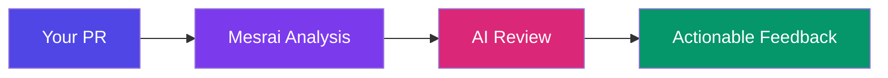
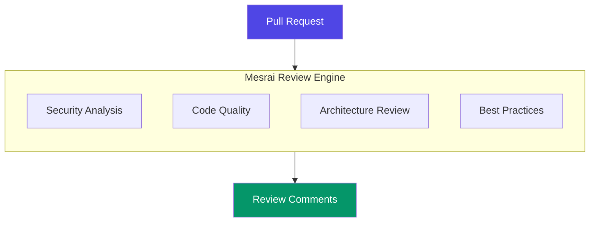
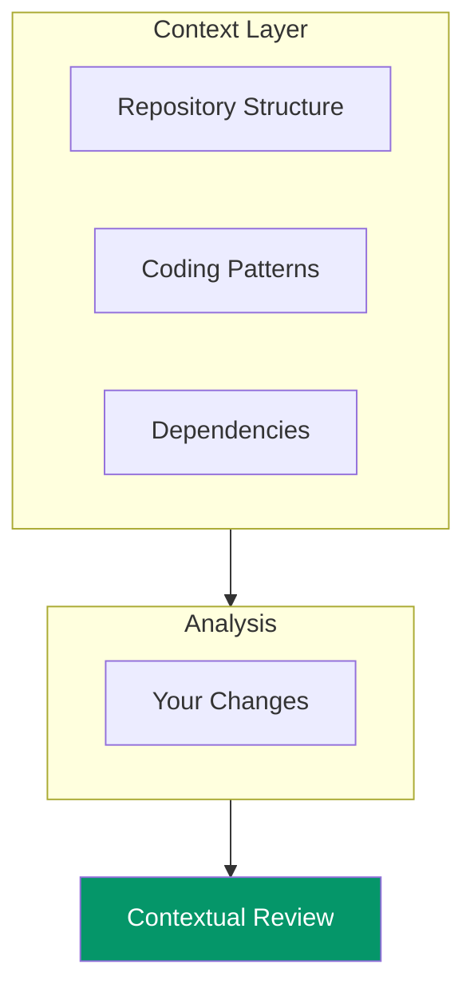
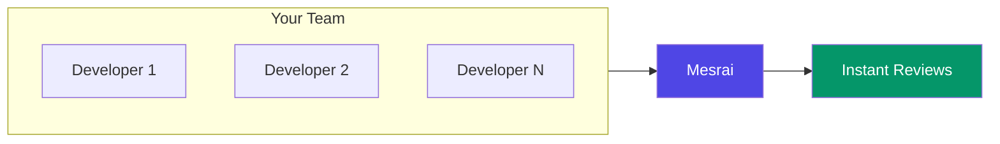

import { Callout } from 'nextra/components'

# Core Architecture

Mesrai AI is built on a modern, enterprise-grade architecture designed to deliver intelligent code reviews at scale. Our platform seamlessly integrates with your existing workflow while providing deep, context-aware analysis.

## How It Works

Mesrai follows a streamlined review process that delivers actionable insights within seconds of opening a pull request.

### The Review Process

1. **Connect** — Install the Mesrai GitHub App on your repositories
2. **Open a PR** — Create a pull request as you normally would
3. **Automatic Analysis** — Mesrai instantly analyzes your changes
4. **Get Feedback** — Receive intelligent, actionable review comments

---

## Multi-Agent Review System

Mesrai uses specialized AI agents that work together to provide comprehensive code reviews from multiple perspectives.

### What We Analyze

| Focus Area | What You Get |
|------------|--------------|
| **Security** | Vulnerability detection, secrets scanning, auth issues |
| **Code Quality** | Complexity analysis, maintainability suggestions |
| **Architecture** | Design patterns, dependency analysis, SOLID principles |
| **Best Practices** | Language-specific recommendations, performance tips |

<Callout type="info">
Each review is tailored to your codebase context, ensuring relevant and actionable feedback.
</Callout>

---

## Intelligent Context Awareness

Unlike simple pattern matching tools, Mesrai understands your entire codebase to provide contextually relevant reviews.

### What Makes Us Different

- **Full Codebase Understanding** — We analyze your entire repository, not just the diff
- **Historical Context** — Learn from your team's patterns and preferences
- **Cross-File Analysis** — Understand how changes impact related code
- **Language Intelligence** — Deep understanding of language-specific patterns

---

## Supported Languages

Mesrai provides deep semantic analysis for all major programming languages:

| Language | Analysis Depth |
|----------|----------------|
| **TypeScript / JavaScript** | Full AST analysis, type checking |
| **Python** | PEP compliance, type hints, patterns |
| **Java** | Design patterns, Spring/Maven support |
| **Go** | Idiomatic Go, concurrency patterns |
| **Ruby** | Rails conventions, gem analysis |
| **C# / .NET** | .NET patterns, async analysis |
| **And more...** | 20+ languages supported |

---

## Review Quality

Every review goes through multiple quality checks to ensure you receive only actionable, high-value feedback.

### Our Quality Promise

<Callout type="info">
**What you can expect:**
- No false positives or noisy alerts
- Actionable suggestions with code examples
- Context-aware recommendations
- Consistent review quality across your team
</Callout>

### Review Verdicts

| Verdict | What It Means |
|---------|---------------|
| **Approved** | Your code looks great, no issues found |
| **Suggestions** | Optional improvements to consider |
| **Changes Requested** | Important issues that should be addressed |

---

## Enterprise Ready

Mesrai is built for teams of all sizes, from startups to large enterprises.

### Security & Privacy

- **Zero Code Storage** — Your code is never stored after analysis
- **Sandbox Processing** — Code analyzed in isolated environments
- **Encryption** — All data encrypted in transit (TLS 1.3)
- **Access Control** — Fine-grained permissions via GitHub OAuth

### Scalability

- Handle thousands of PRs per day
- Consistent performance at any scale
- 99.9% uptime SLA for enterprise plans

---

## Integration

Mesrai integrates seamlessly with your existing development workflow.

### GitHub Integration

| Feature | Description |
|---------|-------------|
| **PR Comments** | Inline suggestions on your code |
| **Check Runs** | CI/CD status integration |
| **Auto-Review** | Automatic reviews on every PR |
| **Chat Commands** | Interact with Mesrai in PR comments |

### Coming Soon

- GitLab Integration
- Bitbucket Integration
- Azure DevOps Integration

---

## Configuration

Customize Mesrai to match your team's standards and preferences via the [Mesrai Dashboard](https://app.mesrai.com):

1. Go to **Settings** → Select your repository
2. Configure review options

### What You Can Configure

- Review focus areas and severity levels
- File and folder exclusions
- Custom rules and patterns
- Team-specific preferences
- Notification settings

---

## Getting Started

Ready to experience intelligent code reviews?

- [Quick Start Guide](/setup/quick-start) — Get up and running in minutes
- [Installation](/setup/installation) — Step-by-step setup instructions
- [Configuration](/setup/configuration) — Customize Mesrai for your team
- [GitHub Integration](/integrations/github) — Connect your repositories

---

<Callout>
**Questions?** Check out our [FAQ](/faq) or [contact our team](https://mesrai.com/contact) for help.
</Callout>
