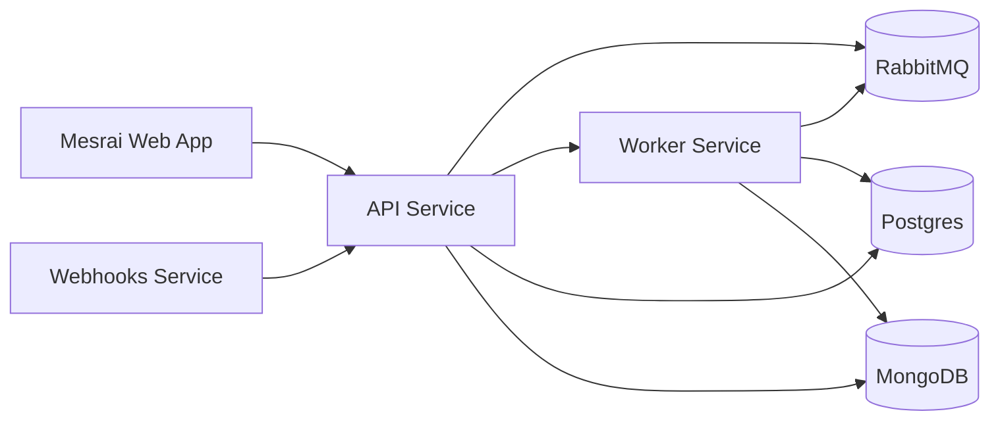

import { Card, CardGroup, Steps, Step, Tabs, Tab, Accordion, AccordionGroup, Note, Info, Tip, Warning, Check, Frame, Snippet, Icon, Callout } from '@/components/mdx'

## Overview

Mesrai runs as a small set of containerized services connected over isolated Docker networks. The split between web, API, worker, and webhook handlers lets each component scale independently and keeps PR-review traffic from blocking dashboard requests.

## Network segmentation

Three networks separate concerns:

- **shared-network** — public ingress + edge routing
- **mesrai-backend-services** — internal service-to-service traffic
- **monitoring-network** — Prometheus / Grafana scraping (optional)

## Service topology

### 1. Web app

Next.js 15 frontend. Talks directly to the API service; no intermediate BFF layer.

### 2. Backend services

The 2.0 stack splits backend responsibility into three dedicated services:

- **API** — request handling + business logic
- **Worker** — async jobs (reviews, rule generation, memory updates)
- **Webhooks** — Git-provider webhook ingestion, validated + forwarded to the API queue

### 3. MCP Manager

The MCP Manager catalogs available MCP providers + integrations and exposes them to the Plugins screen in the workspace. Teams install MCPs from there.

### 4. Data stores

Two databases, picked per access pattern:

- **Postgres** — relational data + embedding metadata
- **MongoDB** — flexible document storage (review payloads, configs)

### 5. Messaging + observability

- **RabbitMQ** is mandatory in 2.0 — it carries every async hop between API, worker, and webhooks
- **Prometheus + Grafana** are optional, recommended for production

### 6. Cloud-only auxiliary services

Mesrai Cloud adds a few closed-source services (billing, analytics, chat integrations). Self-hosted deployments don't need any of them.

## Next steps

<CardGroup cols={2}>
  <Card title="Run Mesrai locally" icon="laptop" href="/operations/local_quickstart/orchestrator">
    The fastest way to spin the full stack on your laptop and get familiar with the components.
  </Card>
  <Card title="Deploy Mesrai to production" icon="rocket" href="/operations/deploy_mesrai/generic_vm">
    Step-by-step guide for getting the stack running on a generic VM.
  </Card>
</CardGroup>
